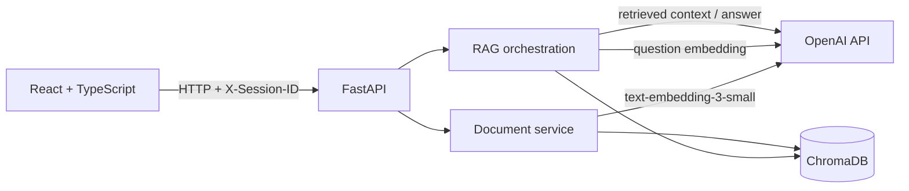

# AI Document Assistant

A full-stack Retrieval-Augmented Generation (RAG) application for asking questions about PDF documents and receiving answers with page-level citations.

The project combines a React interface, a FastAPI API, OpenAI models, and a persistent ChromaDB index. It is designed as a production-minded reference implementation: document and session isolation, citation validation, retrieval evaluation, structured observability, rate limiting, prompt-injection defenses, automated tests, and Docker support are included.

## Highlights

- Upload and validate text-based PDF documents.
- Follow extraction and indexing progress in real time.
- Keep chunk provenance at the PDF-page level.
- Search one document or all documents in the active browser session.
- Generate answers with citations such as `[p. 13]`.
- Validate every model-generated citation against retrieved evidence.
- Prevent duplicate indexing with session-scoped SHA-256 hashes.
- Automatically expire documents after a configurable TTL.
- Measure retrieval quality, citation accuracy, latency, and token usage.

## Demo workflow

1. The browser creates a UUID and sends it as `X-Session-ID`.
2. The user uploads a PDF.
3. The API extracts text page by page, creates overlapping chunks, and generates embeddings.
4. ChromaDB stores the embeddings and document metadata for that session.
5. A question is embedded and matched against the six closest chunks.
6. `gpt-4.1-mini` answers from the retrieved context.
7. The API accepts only citations that point to chunks actually retrieved.

## Architecture



The backend keeps HTTP orchestration in `app/routers`, business and integration logic in `app/services`, and request/response contracts in `app/models`.

```text
app/                    FastAPI backend
  routers/              System, document, and chat endpoints
  services/             PDF, OpenAI, and vector database logic
  models/               API data models
frontend/               React + Vite client
evaluation/             Retrieval, citation, generation, and latency benchmarks
tests/                  Unit and integration tests
```

## RAG design

### Ingestion

```text
PDF validation
  -> SHA-256 duplicate check
  -> page-aware text extraction
  -> 500-character chunks with 100-character overlap
  -> text-embedding-3-small
  -> persistent ChromaDB collection
```

Chunks never cross page boundaries. Each stored chunk includes its document ID, filename, file hash, chunk index, page number, page count, session ID, creation time, and expiration time.

This application extracts embedded text with `pypdf`; it does not currently perform OCR. Scanned image-only PDFs may therefore be rejected as empty.

### Retrieval and generation

The production retrieval configuration is:

| Setting | Value |
|---|---:|
| Candidates (`Top-K`) | 6 |
| Maximum vector distance | 1.2 |
| Generation model | `gpt-4.1-mini` |
| Embedding model | `text-embedding-3-small` |

Retrieved text is explicitly treated as untrusted input. The model returns a structured answer and a list of source IDs; the backend maps only valid, retrieved IDs to page citations. Model-written page numbers and unknown source markers are discarded.

## Evaluation results

The repository includes a reproducible 25-question ground-truth dataset covering direct questions, paraphrases, similar sections, boundary context, numeric confusion, and exact identifiers.

| Metric | Result |
|---|---:|
| Page Hit@1 | 92% |
| Page Hit@2 | 96% |
| Page Hit@3 | 100% |
| MRR | 0.9533 |
| Evidence Hit@6 | 100% (25/25) |
| Citation Hit | 100% (25/25) |

The initial Top-4 configuration reached 100% Page Hit@4 but only 96% Evidence Hit@4. The missing evidence appeared at vector rank 6, so the production configuration was changed to Top-6. A local FlashRank reranking experiment was also evaluated and rejected because it reduced overall retrieval quality.

### Latency baseline

The recorded 25-request end-to-end benchmark reports:

| Metric | Result |
|---|---:|
| Average latency | 2.34 s |
| p50 | 2.28 s |
| p95 | 3.17 s |
| Average retrieval | 661 ms |
| Average OpenAI generation | 1,676 ms |
| Average input tokens | 989.08 |
| Average output tokens | 51.68 |

Raw reports are available in [`evaluation/results`](evaluation/results), and the evaluation commands are documented in [`evaluation/README.md`](evaluation/README.md).

## Estimated API cost

Using the recorded average token consumption and standard API prices on September 11, 2026:

```text
(989.08 input tokens x $0.40/M) + (51.68 output tokens x $1.60/M)
= approximately $0.000478 per answer
```

The query embedding adds much less than $0.000001 for a typical short question. At the measured average, generation costs are approximately:

| Questions | Estimated OpenAI cost (USD) |
|---:|---:|
| 1,000 | $0.48 |
| 10,000 | $4.78 |
| 100,000 | $47.83 |

Indexing the included 17-page benchmark PDF costs approximately $0.00022-$0.00029 once. Actual cost varies with document size, prompt length, response length, retries, and future pricing. Hosting, storage, bandwidth, taxes, and payment-provider charges are not included. Check the current [OpenAI API pricing](https://openai.com/api/pricing/) before budgeting.

## Requirements

- Python 3.12
- Node.js with npm
- An OpenAI API key
- Docker and Docker Compose (optional)

## Quick start

### 1. Configure the backend

```bash
cp .env.example .env
```

Set at least the following value in `.env`:

```dotenv
OPENAI_API_KEY=your_api_key
```

Do not commit the populated `.env` file.

### 2. Start the API

```bash
python -m venv .venv
```

Activate the environment:

```powershell
# Windows PowerShell
.\.venv\Scripts\Activate.ps1
```

```bash
# macOS or Linux
source .venv/bin/activate
```

Install dependencies and run FastAPI:

```bash
python -m pip install -r requirements.txt
python -m uvicorn app.main:app --reload --port 8000
```

The API is available at <http://localhost:8000> and its interactive OpenAPI documentation at <http://localhost:8000/docs>.

### 3. Start the frontend

In a second terminal:

```bash
cd frontend
cp .env.example .env
npm install
npm run dev
```

Open <http://localhost:5173>. Set `VITE_API_URL` in `frontend/.env` if the API runs at another address.

## Docker

The provided Compose configuration builds and runs the backend API only:

```bash
docker compose up --build
```

Run it in the background and check its health with:

```bash
docker compose up -d --build
curl http://localhost:8000/health
```

ChromaDB data is stored in the `chroma_data` named volume at `/app/chroma_db`, so it survives container recreation.

```bash
docker compose down
```

> [!WARNING]
> `docker compose down -v` also deletes the ChromaDB volume and all indexed documents. Use it only when that deletion is intentional.

The React frontend must still be run separately with npm or deployed as a static build.

## Configuration

Backend defaults are defined in [`.env.example`](.env.example):

| Variable | Default | Purpose |
|---|---:|---|
| `ALLOWED_ORIGINS` | local Vite origins | Comma-separated CORS allowlist |
| `PDF_MAX_SIZE_BYTES` | `10485760` | Maximum PDF size (10 MiB) |
| `PDF_MAX_PAGES` | `300` | Maximum pages in one PDF |
| `PDF_MAX_TOTAL_PAGES` | `300` | Maximum indexed pages per session |
| `RATE_LIMIT_WINDOW_SECONDS` | `60` | Rate-limit window |
| `UPLOAD_RATE_LIMIT_REQUESTS` | `5` | Uploads allowed per window |
| `CHAT_RATE_LIMIT_REQUESTS` | `20` | Shared chat requests per window |
| `OPENAI_TIMEOUT_SECONDS` | `30` | OpenAI request timeout |
| `OPENAI_MAX_RETRIES` | `0` | SDK retry count |
| `OPENAI_MAX_CONCURRENCY` | `4` | Concurrent OpenAI operations |
| `DOCUMENT_TTL_HOURS` | `24` | Document retention period |

`APP_NAME`, `APP_VERSION`, and `APP_ENV` may also be set. `CHROMA_DB_PATH` defaults to `./chroma_db`; Docker overrides it with `/app/chroma_db`.

## API overview

| Method | Endpoint | Purpose |
|---|---|---|
| `GET` | `/` | API greeting |
| `GET` | `/health` | Health check |
| `GET` | `/about` | Application metadata |
| `GET` | `/documents` | List session documents |
| `GET` | `/upload-progress/{upload_id}` | Read upload progress |
| `POST` | `/upload` | Validate and index a PDF |
| `POST` | `/chat` | Ask across all session documents |
| `POST` | `/chat/document` | Ask within one document |
| `POST` | `/search` | Inspect raw retrieval results |

Document, upload-progress, search, and chat endpoints require this header:

```http
X-Session-ID: 00000000-0000-0000-0000-000000000000
```

The frontend generates and persists the UUID automatically. Controlled API failures use this shape:

```json
{
  "error": {
    "code": "string",
    "message": "string"
  }
}
```

## Security and privacy controls

- MIME type, file size, `%PDF-` signature, parseability, and page count validation.
- Per-session document quotas, deduplication, listing, and retrieval.
- Expiration and cleanup before document and chat operations.
- Separation of trusted instructions from untrusted questions and document text.
- Backend validation of model-returned source IDs.
- Rate limits plus OpenAI timeout and concurrency controls.
- No questions, document text, full answers, API keys, filenames, or raw exception messages in structured RAG logs.

The browser UUID provides data partitioning, not user authentication. Before exposing this service publicly, add authenticated identities and authorization, shared rate limiting for multiple workers, HTTPS, managed secret storage, and a production persistence and backup strategy.

## Observability

Every RAG request emits a structured event with its request ID, endpoint, status, total latency, retrieval latency, OpenAI latency, model, token usage, chunk count, cited source IDs, and cited pages. Sensitive request and document content is intentionally excluded.

## Testing

Run the backend suite:

```bash
python -m pytest -q
```

Build the frontend:

```bash
cd frontend
npm run build
```

Current verified baseline: **129 backend tests passing** and a successful production frontend build. Tests use temporary ChromaDB directories and do not modify the application's persistent collection. GitHub Actions runs the Python test suite on pushes and pull requests.

## Current limitations

- The Docker setup does not package or serve the frontend.
- ChromaDB is local and single-node; the Docker volume is not a production backup strategy.
- Rate limiting and upload progress are in memory and are not shared across workers or replicas.
- Session UUIDs are not authentication.
- Only PDFs with extractable text are supported; there is no OCR pipeline.
- OpenAI model names and retrieval thresholds are currently defined in code rather than environment variables.

Any change to chunking, embeddings, thresholds, Top-K, or reranking should be measured against the existing evaluation baseline before replacing the production configuration.

## Roadmap

- Authenticated multi-user access
- Production deployment and managed vector persistence
- Shared rate limiting and progress state
- OCR support for scanned PDFs
- Hybrid lexical/vector retrieval
- Retrieval-quality monitoring with additional datasets
- Model and retrieval configuration through environment variables

## License

Licensed under the [MIT License](LICENSE).
